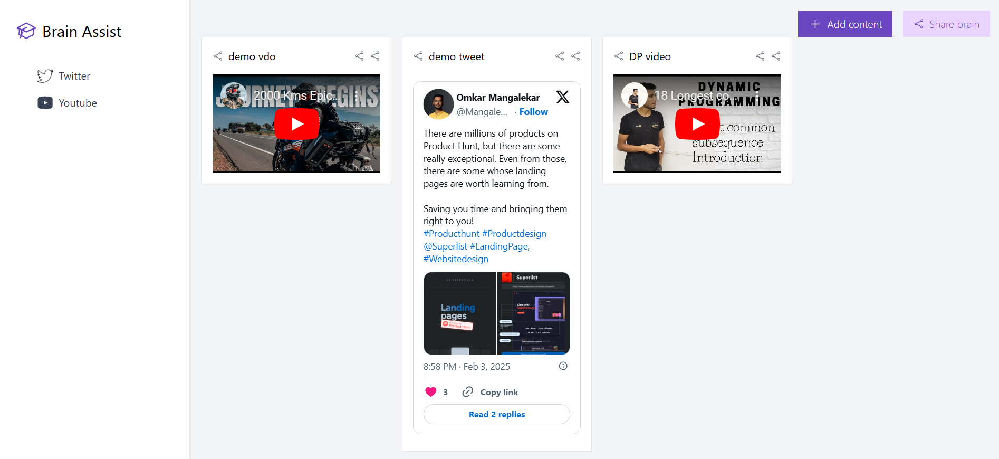

# BrainAssist 🚀

**BrainAssist** is a "second brain" application designed to help users efficiently capture, organize, and retrieve information. Built with **TypeScript** and **React**, it provides a user-friendly interface for managing personal knowledge.

## ✨ Features

- **Information Capture** 📌 – Quickly add notes, ideas, and tasks.
- **Organized Storage** 📂 – Categorize and tag entries for easy access.
- **Search Functionality** 🔍 – Find stored information instantly.
- **User-Friendly Interface** 🎨 – Simple and intuitive design.

## 🚧 Project Status: Under Development

🚨 **BrainAssist is still in active development.** Features are being added and refined, and the application may undergo major changes. Expect regular updates as the project evolves. Feedback and contributions are welcome!

## 🛠 Getting Started

1. **Clone the Repository**
   ```bash
   git clone https://github.com/AnoopVL/BrainAssist.git
   cd BrainAssist
   ```

---

### How the front-end would look like




